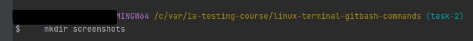
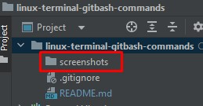

# linux-terminal-gitbash-commands

### Linux terminal (GitBash) commands

| №  | Task title EN                                                                       | Task title RU                                                                      | Title task FI |
|----|-------------------------------------------------------------------------------------|------------------------------------------------------------------------------------|---------------|
| 1  | [Show current directory](#link1)                                                    | Посмотреть где я                                                                   |               |
| 2  | [Create a folder](#link2)                                                           | Создать папку                                                                      |               |
| 3  | [Enter folder](#link3)                                                              | Зайти в папку                                                                      |               |
| 4  | [Create 3 folders](#link4)                                                          | Создать 3 папки                                                                    |               |
| 5  | [Go to any folder](#link5)                                                          | Зайти в любоую папку                                                               |               |           
| 6  | [Create 5 files (3 txt, 2 json)](#link6)                                            | Создать 5 файлов (3 txt, 2 json)                                                   |               |
| 7  | [Create 3 folders](#link7)                                                          | Создать 3 папки                                                                    |               |
| 8  | [List the contents of a folder](#link8)                                             | Вывести список содержимого папки                                                   |               |
| 9  | [Open any txt file](#link9)                                                         | + Открыть любой txt файл                                                           |               |
| 10 | [Write something there, any text.](#link10)                                         | + написать туда что-нибудь, любой текст.                                           |               |
| 11 | [Save and exit](#link11)                                                            | + сохранить и выйти.                                                               |               |
| 12 | [Exit folder one level up](#link12)                                                 | Выйти из папки на уровень выше                                                     |               |
| 13 | [Move any 2 files you created to any other folder.](#link13)                        | переместить любые 2 файла, которые вы создали, в любую другую папку.               |               |
| 14 | [Copy any 2 files you created to any other folder.](#link14)                        | скопировать любые 2 файла, которые вы создали, в любую другую папку.               |               |
| 15 | [Find file by name](#link15)                                                        | Найти файл по имени                                                                |               |
| 16 | [View content in real time (grep command) learn how it works.](#link16 )            | просмотреть содержимое в реальном времени (команда grep) изучите как она работает. |               |
| 17 | [Output the first few lines from a text file](#link17 )                             | вывести несколько первых строк из текстового файла                                 |               |
| 18 | [Output the last few lines from a text file](#link18 )                              | вывести несколько последних строк из текстового файла                              |               |
| 19 | [View the contents of a long file (the less command) learn how it works.](#link19 ) | просмотреть содержимое длинного файла (команда less) изучите как она работает.     |               |
| 20 | [Display date and time](#link20 )                                                   | вывести дату и время                                                               |               |

### Task of increased complexity / Задание повышеной сложности * /

| №  | Task title EN                                                                                      | Task title RU                                                                      |
|----|----------------------------------------------------------------------------------------------------|------------------------------------------------------------------------------------|
| 21 | [Send an http request to the server. <br/> http://162.55.220.72:5006/terminal-hw-request](#link21) | [Отправить http запрос на сервер. http://162.55.220.72:5006/terminal-hw-request]() |
| 22 | [Write a script that will automatically <br/> execute the points 3, 4, 5, 6, 7, 8, 13](#link22)    | Написать скрипт который выполнит автоматически пункты 3, 4, 5, 6, 7, 8, 13         |

### Solution of tasks / Решение задач / 

### <a id="link1">1. Show current directory / Посмотреть где я</a>

Input:
```` bash
    pwd    
````
Output:
````
    .... MINGW64 /c/var/1a-testing-course/linux-terminal-gitbash-commands (master)
    $ pwd    
    /c/var/1a-testing-course/linux-terminal-gitbash-commands
````
### <a id="link2">2. Create a folder | Создать папку</a>

Input:
```` bash
    mkdir screenshots
    ls
````
Step one



Result



Output:
````
    ... MINGW64 /c/var/1a-testing-course/linux-terminal-gitbash-commands (task-2)
    $     mkdir screenshots 
    
    ... MINGW64 /c/var/1a-testing-course/linux-terminal-gitbash-commands (task-2)
    $     ls                                                                                      
    README.md  screenshots
````

### <a id="link3">3. Enter folder | Зайти в папку</a>

Input:
```` bash
    pwd
    cd screenshots
    pwd
````
Output:
````
    ... MINGW64 /c/var/1a-testing-course/linux-terminal-gitbash-commands (task-3)
    $ pwd 
    /c/var/1a-testing-course/linux-terminal-gitbash-commands
    
    ... MINGW64 /c/var/1a-testing-course/linux-terminal-gitbash-commands (task-3)
    $ cd screenshots
    
    ... MINGW64 /c/var/1a-testing-course/linux-terminal-gitbash-commands/screenshots (task-3)
    $ pwd                                                                                                     
    /c/var/1a-testing-course/linux-terminal-gitbash-commands/screenshots
````

### <a id="link4">4. Create 3 folders | Создать 3 папки</a>

Input:
```` bash
    
````
Output:
````

````

### <a id="link5">5. Go to any folder | Зайти в любоую папку</a>

Input:
```` bash
    
````
Output:
````

````

### <a id="link6">6. Create 5 files (3 txt, 2 json) | Создать 5 файлов (3 txt, 2 json)</a>

Input:
```` bash
    
````
Output:
````

````

### <a id="link7">7. Create 3 folders | Создать 3 папки</a>

Input:
```` bash
    
````
Output:
````

````

### <a id="link8">8. List the contents of a folder | Вывести список содержимого папки</a>

Input:
```` bash
    
````
Output:
````

````

### <a id="link9">9. Open any txt file | + Открыть любой txt файл</a>

Input:
```` bash
    
````
Output:
````

````

### <a id="link10">10. Write something there, any text. | + написать туда что-нибудь, любой текст.</a>

Input:
```` bash
    
````
Output:
````

````
### <a id="link11">11. Save and exit | + сохранить и выйти.</a>

Input:
```` bash
    
````
Output:
````

````
### <a id="link12">12. Exit folder one level up | Выйти из папки на уровень выше</a>

Input:
```` bash
    
````
Output:
````

````
### <a id="link13">13. Move any 2 files you created to any other folder. | переместить любые 2 файла, которые вы создали, в любую другую папку.</a>

Input:
```` bash
    
````
Output:
````

````
### <a id="link14">14. Copy any 2 files you created to any other folder. | скопировать любые 2 файла, которые вы создали, в любую другую папку.</a>

Input:
```` bash
    
````
Output:
````

````
### <a id="link15">15. Find file by name | Найти файл по имени</a>

Input:
```` bash
    
````
Output:
````

````
### <a id="link16">16. View content in real time (grep command) learn how it works. | просмотреть содержимое в реальном времени (команда grep) изучите как она работает.</a>

Input:
```` bash
    
````
Output:
````

````
### <a id="link17">17. Output the first few lines from a text file | вывести несколько первых строк из текстового файла</a>

Input:
```` bash
    
````
Output:
````

````
### <a id="link18">18. Output the last few lines from a text file | вывести несколько последних строк из текстового файла</a>

Input:
```` bash
    
````
Output:
````

````
### <a id="link19">19. View the contents of a long file (the less command) learn how it works. | просмотреть содержимое длинного файла (команда less) изучите как она работает.</a>

Input:
```` bash
    
````
Output:
````

````
### <a id="link20">20. Display date and time | вывести дату и время</a>

Input:
```` bash
    
````
Output:
````

````


### <a id="link21">21. Send an http request to the server. http://162.55.220.72:5006/terminal-hw-request | Отправить http запрос на сервер. http://162.55.220.72:5006/terminal-hw-request</a>

Input:
```` bash
    
````
Output:
````

````
### <a id="link22">22. Write a script that will automatically execute the points 3, 4, 5, 6, 7, 8, 13 | Написать скрипт который выполнит автоматически пункты 3, 4, 5, 6, 7, 8, 13</a>

Input:
```` bash
    
````
Output:
````

````