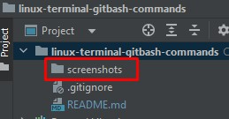

# linux-terminal-gitbash-commands

### <a id="back_to_list">Linux terminal (GitBash) commands </a>

| №  | Task title EN                                                                           | Task title RU                                                                      | Title task FI |
|----|-----------------------------------------------------------------------------------------|------------------------------------------------------------------------------------|---------------|
| 1  | [Show the current directory](#link1)                                                    | Посмотреть где я                                                                   |               |
| 2  | [Create a folder](#link2)                                                               | Создать папку                                                                      |               |
| 3  | [Enter folder](#link3)                                                                  | Зайти в папку                                                                      |               |
| 4  | [Create 3 folders](#link4)                                                              | Создать 3 папки                                                                    |               |
| 5  | [Go to any folder](#link5)                                                              | Зайти в любоую папку                                                               |               |   
| 6  | [Create 5 files (3 txt, 2 json)](#link6)                                                | Создать 5 файлов (3 txt, 2 json)                                                   |               |
| 7  | [Create 3 folders](#link7)                                                              | Создать 3 папки                                                                    |               |
| 8  | [List the contents of a folder](#link8)                                                 | Вывести список содержимого папки                                                   |               |
| 9  | [Open any txt file](#link9)                                                             | + Открыть любой txt файл                                                           |               |
| 10 | [Write something there, any text.](#link10)                                             | + написать туда что-нибудь, любой текст.                                           |               |
| 11 | [Save and exit](#link11)                                                                | + сохранить и выйти.                                                               |               |
| 12 | [Exit folder one level up](#link12)                                                     | Выйти из папки на уровень выше                                                     |               |
| 13 | [Move any 2 files you created to any other folder.](#link13)                            | переместить любые 2 файла, которые вы создали, в любую другую папку.               |               |
| 14 | [Copy any 2 files you created to any other folder.](#link14)                            | скопировать любые 2 файла, которые вы создали, в любую другую папку.               |               |
| 15 | [Find a file by name](#link15)                                                          | Найти файл по имени                                                                |               |
| 16 | [View content in real-time (grep command) and learn how it works.](#link16 )            | просмотреть содержимое в реальном времени (команда grep) изучите как она работает. |               |
| 17 | [Output the first few lines from a text file](#link17 )                                 | вывести несколько первых строк из текстового файла                                 |               |
| 18 | [Output the last few lines from a text file](#link18 )                                  | вывести несколько последних строк из текстового файла                              |               |
| 19 | [View the contents of a long file (the less command) and learn how it works.](#link19 ) | просмотреть содержимое длинного файла (команда less) изучите как она работает.     |               |
| 20 | [Display date and time](#link20 )                                                       | вывести дату и время                                                               |               |

### Task of increased complexity / Задание повышеной сложности * /

| №  | Task title EN                                                                                      | Task title RU                                                                      |
|----|----------------------------------------------------------------------------------------------------|------------------------------------------------------------------------------------|
| 21 | [Send an http request to the server. <br/> http://162.55.220.72:5006/terminal-hw-request](#link21) | [Отправить http запрос на сервер. http://162.55.220.72:5006/terminal-hw-request]() |
| 22 | [Write a script that will automatically <br/> execute the points 3, 4, 5, 6, 7, 8, 13](#link22)    | Написать скрипт который выполнит автоматически пункты 3, 4, 5, 6, 7, 8, 13         |

### Solution of tasks / Решение задач / 

### <a id="link1">1. Show the current directory / Посмотреть где я</a>  |  [Back to list](#back_to_list)

Input:
```` bash
pwd    
````

Output:
````
... MINGW64 /c/var/1a-testing-course/linux-terminal-gitbash-commands (master)
$ pwd    
/c/var/1a-testing-course/linux-terminal-gitbash-commands
````
### <a id="link2">2. Create a folder | Создать папку</a>  |  [Back to list](#back_to_list)

Input:
```` bash
mkdir screenshots
ls
````

Result



Output:
````
... MINGW64 /c/var/1a-testing-course/linux-terminal-gitbash-commands (task-2)
$ mkdir screenshots 

... MINGW64 /c/var/1a-testing-course/linux-terminal-gitbash-commands (task-2)
$ ls
README.md  screenshots
````

### <a id="link3">3. Enter folder | Зайти в папку</a>  |  [Back to list](#back_to_list)

Input:
```` bash
pwd
cd screenshots
pwd
````

Output:
````
... MINGW64 /c/var/1a-testing-course/linux-terminal-gitbash-commands (task-3)
$ pwd 
/c/var/1a-testing-course/linux-terminal-gitbash-commands

... MINGW64 /c/var/1a-testing-course/linux-terminal-gitbash-commands (task-3)
$ cd screenshots

... MINGW64 /c/var/1a-testing-course/linux-terminal-gitbash-commands/screenshots (task-3)
$ pwd
/c/var/1a-testing-course/linux-terminal-gitbash-commands/screenshots
````

### <a id="link4">4. Create 3 folders | Создать 3 папки</a>  |  [Back to list](#back_to_list)

Input:
```` bash
mkdir task_4
cd task_4 
mkdir cild_dir_1 cild_dir_2 cild_dir_3
cd ..
````

Output:
````
... MINGW64 /c/var/1a-testing-course/linux-terminal-gitbash-commands (task-4)
$ mkdir cild_dir_1 cild_dir_2 cild_dir_3

... MINGW64 /c/var/1a-testing-course/linux-terminal-gitbash-commands (task-4)
$ mkdir task_4

... MINGW64 /c/var/1a-testing-course/linux-terminal-gitbash-commands (task-4)
$ cd task_4

... MINGW64 /c/var/1a-testing-course/linux-terminal-gitbash-commands/task_4 (task-4)
$ mkdir cild_dir_1 cild_dir_2 cild_dir_3

... MINGW64 /c/var/1a-testing-course/linux-terminal-gitbash-commands/task_4 (task-4)
$ ls
cild_dir_1  cild_dir_2  cild_dir_3
````

#### Some examples extra:

Input:
```` bash
cd task_4
mkdir extra_examples
cd extra_examples
mkdir dir{1..5}
ls 
mkdir {1,2,3}
ls
mkdir test{01..5}  
ls  
mkdir -p dir_parent/cild_dir_{1..3}
ls
cd dir_parent
ls
cd ..
mkdir -p `date '+%y%m%d'`/{1,2,3}
ls
cd `date '+%y%m%d'`
ls
cd ..
````
Output:
````
... MINGW64 /c/var/1a-testing-course/linux-terminal-gitbash-commands/task_4 (task-4)
$ cd task_4

... MINGW64 /c/var/1a-testing-course/linux-terminal-gitbash-commands/task_4 (task-4)
$ mkdir extra_examples

... MINGW64 /c/var/1a-testing-course/linux-terminal-gitbash-commands/task_4 (task-4)
$ cd extra_examples

... MINGW64 /c/var/1a-testing-course/linux-terminal-gitbash-commands/task_4/extra_examples (task-4)
$ mkdir dir{1..5}

... MINGW64 /c/var/1a-testing-course/linux-terminal-gitbash-commands/task_4/extra_examples (task-4)
$ ls
dir1  dir2  dir3  dir4  dir5

... MINGW64 /c/var/1a-testing-course/linux-terminal-gitbash-commands/task_4/extra_examples (task-4)
$ mkdir {1,2,3}

... MINGW64 /c/var/1a-testing-course/linux-terminal-gitbash-commands/task_4/extra_examples (task-4)
$ ls
1  2  3  dir1  dir2  dir3  dir4  dir5

... MINGW64 /c/var/1a-testing-course/linux-terminal-gitbash-commands/task_4/extra_examples (task-4)
$ mkdir test{01..5}

$ cd dir_parent

... MINGW64 /c/var/1a-testing-course/linux-terminal-gitbash-commands/task_4/extra_examples/dir_parent (task-4)
$ ls
cild_dir_1  cild_dir_2  cild_dir_3

... MINGW64 /c/var/1a-testing-course/linux-terminal-gitbash-commands/task_4/extra_examples/dir_parent (task-4)
$ cd ..

... MINGW64 /c/var/1a-testing-course/linux-terminal-gitbash-commands/task_4/extra_examples (task-4)
$ mkdir -p `date '+%y%m%d'`/{1,2,3}

... MINGW64 /c/var/1a-testing-course/linux-terminal-gitbash-commands/task_4/extra_examples (task-4)
$ ls
1  2  230801  3  dir1  dir2  dir3  dir4  dir5  dir_parent  test01  test02  test03  test04  test05

... MINGW64 /c/var/1a-testing-course/linux-terminal-gitbash-commands/task_4/extra_examples (task-4)
$ cd `date '+%y%m%d'`

... MINGW64 /c/var/1a-testing-course/linux-terminal-gitbash-commands/task_4/extra_examples/230801 (task-4)
$ ls
1  2  3

... MINGW64 /c/var/1a-testing-course/linux-terminal-gitbash-commands/task_4/extra_examples/230801 (task-4)
$ cd ..
````

### <a id="link5">5. Go to any folder</a>  |  [Back to list](#back_to_list)

#### Description

> В Git Bash команда `tree` не доступна, но возможно это настроить. скачать с сайта `Zip` файл `Binaries`: https://gnuwin32.sourceforge.net/packages/tree.htm  
> в архиве находится директорию `bin` в ней есть файл `tree.exe`, поместить его в директорию `...\Git\usr\bin` обычно
> она находится по адресу `C:\Program Files\Git\usr\bin`. После перезпуска `Git Bash` команда `tree` станет доступна.

Input:
```` bash
mkdir -p task_5/cild_dir_task_{1..3}
tree
cd task_5/cild_dir_task_2
pwd
````

Output:
````
... MINGW64 /c/var/1a-testing-course/linux-terminal-gitbash-commands/task_5 (dev)
$ mkdir -p task_5/cild_dir_task_{1..3}                                                            

... MINGW64 /c/var/1a-testing-course/linux-terminal-gitbash-commands/task_5 (dev)
$ tree                                                                                            
.                   
|-- README.md       
`-- task_5          
    |-- cild_dir_task_1
    |-- cild_dir_task_2
    `-- cild_dir_task_3
                       
4 directories, 1 file  

... MINGW64 /c/var/1a-testing-course/linux-terminal-gitbash-commands/task_5 (dev)
$ cd task_5/cild_dir_task_2                                                                       

... MINGW64 /c/var/1a-testing-course/linux-terminal-gitbash-commands/task_5/task_5/cild_dir_task_2 (dev)
$ pwd                                                                                                                    
/c/var/1a-testing-course/linux-terminal-gitbash-commands/task_5/task_5/cild_dir_task_2    
````

### <a id="link6">6. Create 5 files (3 txt, 2 json)</a>  |  [Back to list](#back_to_list)

Input:
```` bash
mkdir task_6
cd task_6
touch file1.txt file2.txt file3.txt file4.json file5.json
cd ..
tree
````

Output:
````
... MINGW64 /c/var/1a-testing-course/linux-terminal-gitbash-commands/task_6 (dev)
$ mkdir task_6                                                                                    

... MINGW64 /c/var/1a-testing-course/linux-terminal-gitbash-commands/task_6 (dev)
$ cd task_6                                                                                       

... MINGW64 /c/var/1a-testing-course/linux-terminal-gitbash-commands/task_6/task_6 (dev)
$ touch file1.txt file2.txt file3.txt file4.json file5.json                                              

... MINGW64 /c/var/1a-testing-course/linux-terminal-gitbash-commands/task_6/task_6 (dev)
$ cd ..                                                                                                  

... MINGW64 /c/var/1a-testing-course/linux-terminal-gitbash-commands/task_6 (dev)
$ tree                                                                                            
.
|-- README.md    
`-- task_6       
    |-- file1.txt
    |-- file2.txt
    |-- file3.txt
    |-- file4.json
    `-- file5.json

1 directory, 6 files
````

### <a id="link7">7. Create 3 folders</a>  |  [Back to list](#back_to_list)

Input:
```` bash
mkdir -p task_7/task_folder{1..3}
cd task_7
touch task_folder{1..3}/task_7.log task_folder{1..3}/task_7.json task_folder{1..3}/task_7.txt
tree
````

Output:
````
... MINGW64 /c/var/1a-testing-course/linux-terminal-gitbash-commands/task_7 (dev)
$ mkdir -p task_7/task_folder{1..3}                                                               

... MINGW64 /c/var/1a-testing-course/linux-terminal-gitbash-commands/task_7 (dev)
$ cd task_7                                                                                       

... MINGW64 /c/var/1a-testing-course/linux-terminal-gitbash-commands/task_7/task_7 (dev)
$ touch task_folder{1..3}/task_7.log task_folder{1..3}/task_7.json task_folder{1..3}/task_7.txt          

... MINGW64 /c/var/1a-testing-course/linux-terminal-gitbash-commands/task_7/task_7 (dev)
$ tree                                                                                                   
.
|-- task_folder1   
|   |-- task_7.json
|   |-- task_7.log 
|   `-- task_7.txt 
|-- task_folder2   
|   |-- task_7.json
|   |-- task_7.log 
|   `-- task_7.txt 
`-- task_folder3
    |-- task_7.json
    |-- task_7.log
    `-- task_7.txt

3 directories, 9 files
````

### <a id="link8">8. List the contents of a folder</a>  |  [Back to list](#back_to_list)

Input:
```` bash
ls
ls -la
ls -l
ls -R
tree
````

Output:
````
... MINGW64 /c/var/1a-testing-course/linux-terminal-gitbash-commands/task_8 (dev)
$ ls                                                                                              
README.md

... MINGW64 /c/var/1a-testing-course/linux-terminal-gitbash-commands/task_8 (dev)
$ ls -la                                                                                          
total 5
drwxr-xr-x 1 Maks 197611   0 Aug  2 22:40 .        
drwxr-xr-x 1 Maks 197611   0 Aug  2 18:51 ..       
-rw-r--r-- 1 Maks 197611 306 Aug  2 22:40 README.md

... MINGW64 /c/var/1a-testing-course/linux-terminal-gitbash-commands/task_8 (dev)
$ ls -l                                                                                           
total 1
-rw-r--r-- 1 Maks 197611 306 Aug  2 22:40 README.md

... MINGW64 /c/var/1a-testing-course/linux-terminal-gitbash-commands/task_8 (dev)
$ ls -R                                                                                           
.:       
README.md

... MINGW64 /c/var/1a-testing-course/linux-terminal-gitbash-commands/task_8 (dev)
$ tree                                                                                            
.                    
`-- README.md        
                     
0 directories, 1 file
````

### <a id="link9">9. Open any txt file</a>  |  [Back to list](#back_to_list)

Input:
```` bash
touch task_9.txt
echo "lorem ipsum" > task_9.txt
cat task_9.txt
````
Output:
````
... MINGW64 /c/var/1a-testing-course/linux-terminal-gitbash-commands/task_9 (dev)
$ touch task_9.txt                                                                                

... MINGW64 /c/var/1a-testing-course/linux-terminal-gitbash-commands/task_9 (dev)
$ echo "lorem ipsum" > task_9.txt                                                                 

... MINGW64 /c/var/1a-testing-course/linux-terminal-gitbash-commands/task_9 (dev)
$ cat task_9.txt                                                                                  
lorem ipsum
````

### <a id="link10">10. Write something there, any text.</a>  |  [Back to list](#back_to_list)

Input:
```` bash
cat > task_10.txt
echo 'any text lorem ipsum' > task_10.txt
````
Output:
````
... MINGW64 /c/var/1a-testing-course/linux-terminal-gitbash-commands/task_10 (dev)
$ cat > task_10.txt                                                                            

... MINGW64 /c/var/1a-testing-course/linux-terminal-gitbash-commands/task_10 (dev)
$ echo 'any text lorem ipsum' > task_10.txt 
````

### <a id="link11">11. Save and exit</a>  |  [Back to list](#back_to_list)

Input:
```` bash
- esc :qw
````
Output:
````
````

### <a id="link12">12. Exit folder one level up</a>  |  [Back to list](#back_to_list)

Input:
```` bash
cd ..
````
Output:
````
... MINGW64 /c/var/1a-testing-course/linux-terminal-gitbash-commands/task_12 (dev)
$ cd ..                                                                                        

... MINGW64 /c/var/1a-testing-course/linux-terminal-gitbash-commands
````

### <a id="link13">13. Move any 2 files you created to any other folder.</a>  |  [Back to list](#back_to_list)

Input:
```` bash
mkdir task_13
touch file1.txt file2.txt
tree
mv file1.txt file2.txt task_13/
tree
````

Output:
````
... MINGW64 /c/var/1a-testing-course/linux-terminal-gitbash-commands/task_13 (dev)
$ mkdir task_13                                                                                    
mkdir: cannot create directory 'task_13': File exists

... MINGW64 /c/var/1a-testing-course/linux-terminal-gitbash-commands/task_13 (dev)
$ touch file1.txt file2.txt                                                                        

... MINGW64 /c/var/1a-testing-course/linux-terminal-gitbash-commands/task_13 (dev)
$ tree                                                                                             
.
|-- README.md    
|-- file1.txt    
|-- file2.txt    
`-- task_13      
    |-- file1.txt
    `-- file2.txt   
                    
1 directory, 5 files

... MINGW64 /c/var/1a-testing-course/linux-terminal-gitbash-commands/task_13 (dev)
$ mv file1.txt file2.txt task_13/                                                                  

... MINGW64 /c/var/1a-testing-course/linux-terminal-gitbash-commands/task_13 (dev)
$ tree                                                                                             
.                   
|-- README.md       
`-- task_13         
    |-- file1.txt   
    `-- file2.txt   
                    
1 directory, 3 files
````

### <a id="link14">14. Copy any 2 files you created to any other folder.</a>  |  [Back to list](#back_to_list)

Input:
```` bash
mkdir task_14
touch file3.txt file4.json
ls
cp file3.txt file4.json task_14/
ls
````
Output:
````
... MINGW64 /c/var/1a-testing-course/linux-terminal-gitbash-commands/task_14 (dev)
$ mkdir task_14                                                                                    
mkdir: cannot create directory 'task_14': File exists

... MINGW64 /c/var/1a-testing-course/linux-terminal-gitbash-commands/task_14 (dev)
$ touch file3.txt file4.json                                                                       

... MINGW64 /c/var/1a-testing-course/linux-terminal-gitbash-commands/task_14 (dev)
$ ls                                                                                               
README.md  file3.txt  file4.json  task_14

... MINGW64 /c/var/1a-testing-course/linux-terminal-gitbash-commands/task_14 (dev)
$ cp file3.txt file4.json task_14/                                                                 

... MINGW64 /c/var/1a-testing-course/linux-terminal-gitbash-commands/task_14 (dev)
$ ls                                                                                               
README.md  file3.txt  file4.json  task_14
````

### <a id="link15">15. Find a file by name</a>  |  [Back to list](#back_to_list)

Input:
```` bash
touch file_name_1.txt file_name_2.txt file_name_3.txt
find . -name 'file_name_2.txt'
````
Output:
````
... MINGW64 /c/var/1a-testing-course/linux-terminal-gitbash-commands/task_15 (dev)
$ touch file_name_1.txt file_name_2.txt file_name_3.txt                                            

... MINGW64 /c/var/1a-testing-course/linux-terminal-gitbash-commands/task_15 (dev)
$ find . -name 'file_name_2.txt'                                                                   
./file_name_2.txt
````

### <a id="link16">16. View content in real-time (grep command) and learn how it works.</a>  |  [Back to list](#back_to_list)

Input:
```` bash
touch example.log
echo "lorem ipsum lorem" >> example.log
echo "lorem ipsum error" >> example.log
tail -f example.log | grep 'error'
````
Output:
````
... MINGW64 /c/var/1a-testing-course/linux-terminal-gitbash-commands/task_16 (dev)
$ touch example.log                                                                            

... MINGW64 /c/var/1a-testing-course/linux-terminal-gitbash-commands/task_16 (dev)
$ echo "lorem ipsum lorem" >> example.log                                                      

... MINGW64 /c/var/1a-testing-course/linux-terminal-gitbash-commands/task_16 (dev)
$ echo "lorem ipsum error" >> example.log                                                      

... MINGW64 /c/var/1a-testing-course/linux-terminal-gitbash-commands/task_16 (dev)
$ tail -f example.log | grep 'error'                                                           
lorem ipsum error

````

### <a id="link17">17. Output the first few lines from a text file</a>  |  [Back to list](#back_to_list)

Input:
```` bash
touch example.txt
echo "lorem ipsum lorem" >> example.txt
echo "lorem ipsum error" >> example.txt
head -n 2 example.txt
````
Output:
````
... MINGW64 /c/var/1a-testing-course/linux-terminal-gitbash-commands/task_17 (dev)
$ touch example.txt                                                                                

... MINGW64 /c/var/1a-testing-course/linux-terminal-gitbash-commands/task_17 (dev)
$ echo "lorem ipsum lorem" >> example.txt                                                          

... MINGW64 /c/var/1a-testing-course/linux-terminal-gitbash-commands/task_17 (dev)
$ echo "lorem ipsum error" >> example.txt                                                          

... MINGW64 /c/var/1a-testing-course/linux-terminal-gitbash-commands/task_17 (dev)
$ head -n 2 example.txt                                                                            
lorem ipsum lorem
lorem ipsum error
  
````

### <a id="link18">18. Output the last few lines from a text file</a>  |  [Back to list](#back_to_list)

Input:
```` bash
touch example.txt
echo "lorem ipsum lorem" >> example.txt
echo "lorem ipsum error" >> example.txt
tail -n 2 example.txt
````
Output:
````
... MINGW64 /c/var/1a-testing-course/linux-terminal-gitbash-commands/task_18 (dev)
$ touch example.txt                                                                                

... MINGW64 /c/var/1a-testing-course/linux-terminal-gitbash-commands/task_18 (dev)
$ echo "lorem ipsum lorem" >> example.txt                                                          

... MINGW64 /c/var/1a-testing-course/linux-terminal-gitbash-commands/task_18 (dev)
$ echo "lorem ipsum error" >> example.txt                                                          

... MINGW64 /c/var/1a-testing-course/linux-terminal-gitbash-commands/task_18 (dev)
$ tail -n 2 example.txt                                                                            
lorem ipsum lorem
lorem ipsum error
````

### <a id="link19">19. View the contents of a long file (the less command) and learn how it works.</a>  |  [Back to list](#back_to_list)

Input:
```` bash
cat > lorem_ipsum.txt
echo 'What is Lorem Ipsum? Lorem Ipsum is simply dummy text of the..' > lorem_ipsum.txt
less lorem_ipsum.txt
````
Output:
````
... MINGW64 /c/var/1a-testing-course/linux-terminal-gitbash-commands/task_19 (dev)
$ cat > lorem_ipsum.txt

... MINGW64 /c/var/1a-testing-course/linux-terminal-gitbash-commands/task_19 (dev)
$ echo 'What is Lorem Ipsum? Lorem Ipsum is simply dummy text of the..' > lorem_ipsum.txt

... MINGW64 /c/var/1a-testing-course/linux-terminal-gitbash-commands/task_19 (dev)
$ less lorem_ipsum.txt

What is Lorem Ipsum? Lorem Ipsum is simply dummy text of the..
~
~
lorem_ipsum.txt (END)
````

### <a id="link20">20. Display date and time</a>  |  [Back to list](#back_to_list)

Input:
```` bash
date
````
Output:
````
... MINGW64 /c/var/1a-testing-course/linux-terminal-gitbash-commands/task_20 (dev)
$ date                                                                                         
Wed Aug  2 22:05:35 FLEDT 2023
````


### <a id="link21">21. Send an http request to the server. http://162.55.220.72:5006/terminal-hw-request</a>  |  [Back to list](#back_to_list)

Input:
````bash
curl "http://162.55.220.72:5006/terminal-hw-request"
curl "http://162.55.220.72:5005/get_method?name=maksim&age=33"
````
Output:
````
... MINGW64 /c/var/1a-testing-course/linux-terminal-gitbash-commands/task_21 (dev)
$ curl "http://162.55.220.72:5006/terminal-hw-request"                                             
{                                                                                                                                 
  "Intro": "Hello!! This is your the first response from server",                                                                 
  "Tasks": {                                                                                                                      
    "Task_1": "Send the next URL in terminal: http://162.55.220.72:5005/get_method?name=(set_your_String)&age=(set_your_number)", 
    "result": [                                                                                                                   
      "Your_String",                                                                                                              
      "Your_number"                                                                                                               
    ]                                                                                                                             
  }                                                                                                                               
}                                                                                                                                 
                                                                                  

... MINGW64 /c/var/1a-testing-course/linux-terminal-gitbash-commands/task_21 (dev)
$ curl "http://162.55.220.72:5005/get_method?name=maksim&age=33"                                   
[           
  "maksim", 
  "33"      
]
````

### <a id="link22">22. Write a script that will automatically execute the points 3, 4, 5, 6, 7, 8, 13</a>  |  [Back to list](#back_to_list)

Input:
```` bash
./myscript.sh
````

Script
```
#!/bin/bash

mkdir task_22

echo "Item 3: Enter folder | Зайти в папку"
cd task_22

echo "Item 4: Create 3 folders"
mkdir folder_{1..3}

echo "Item 5: Go to any folder"
cd folder_1

echo "Item 6: Create 5 files (3 txt, 2 json)"
touch file_1.txt file_2.txt file_3.txt file_4.json file_5.json

echo "Item 7: Create 3 folders"
mkdir folder_4 folder_5 folder_6

echo "Item 8: List the contents of a folder"
ls
tree

echo "Item 13: Move any 2 files you created to any other folder."
mv file_1.txt file_2.txt folder_4/
tree
```

Output:
````
... MINGW64 /c/var/1a-testing-course/linux-terminal-gitbash-commands/task_22 (dev)
$ /bin/bash C:/var/1a-testing-course/linux-terminal-gitbash-commands/task_22/myscript.sh           
Item 3: Enter folder | Зайти в папку
Item 4: Create 3 folders
Item 5: Go to any folder
Item 6: Create 5 files (3 txt, 2 json)
Item 7: Create 3 folders
Item 8: List the contents of a folder
file_1.txt  file_2.txt  file_3.txt  file_4.json  file_5.json  folder_4  folder_5  folder_6
.
|-- file_1.txt 
|-- file_2.txt 
|-- file_3.txt 
|-- file_4.json
|-- file_5.json
|-- folder_4   
|-- folder_5   
`-- folder_6   

3 directories, 5 files                                    
Item 13: Move any 2 files you created to any other folder.
.
|-- file_3.txt 
|-- file_4.json
|-- file_5.json
|-- folder_4
|   |-- file_1.txt
|   `-- file_2.txt
|-- folder_5
`-- folder_6

3 directories, 5 files
````